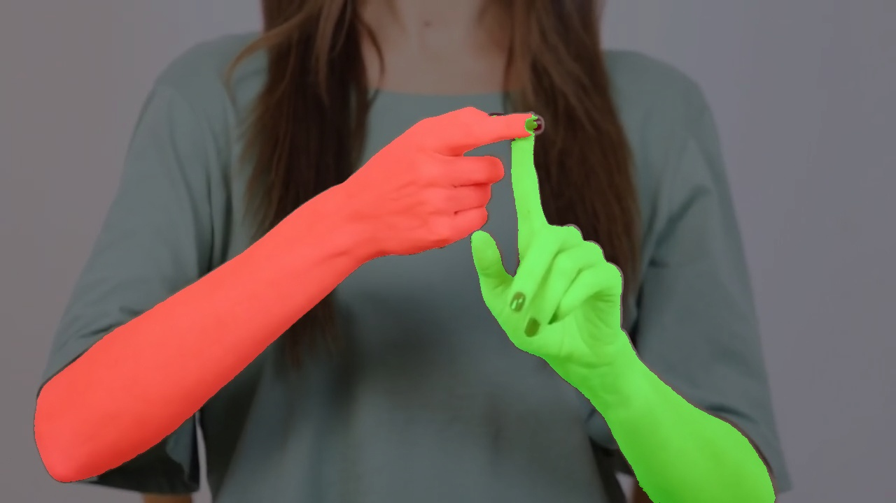
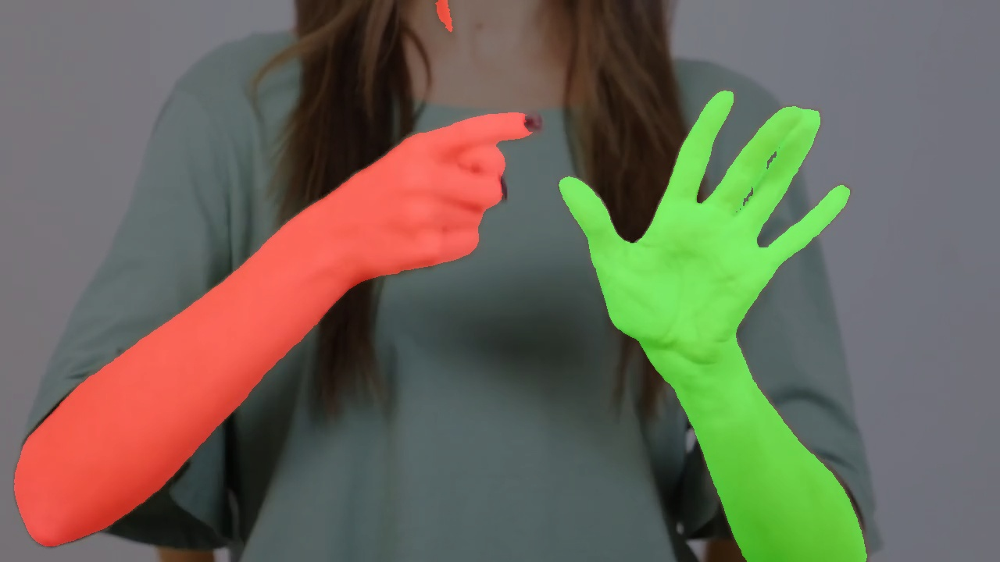
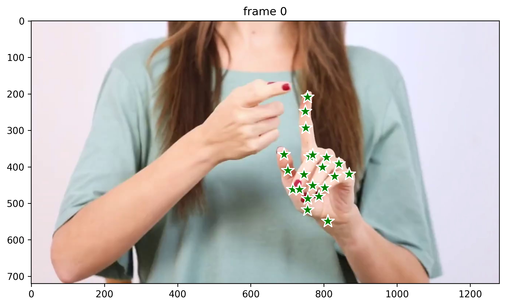

# Hand Segmentation using SAM2

- View output mask video [here](https://github.com/Billa-Man/sa-task/blob/main/output/test_output_with_mask.mp4)
- I used SAM2-tiny in this assignment. The performance can be improved with a larger model.

<table>
  <tr>
    <td></td>
    <td></td>
  </tr>
  <tr>
      <td></td>
  </tr>
</table>

## Technical Overview
### Pipeline Architecture
The hand segmentation pipeline consists of two main stages:

#### 1. Frame Acquisition & Hand Detection
- System captures the initial frame from input source
- This frame serves as the base for hand detection
- We then extract hand points and corresponding labels (left hand and right hand) using Google MediaPipe
#### 2. Segmentation
- Utilizes SAM2 (Segment Anything Model 2) (tiny version)
- Uses detected hand points as initial prompts
- Generates precise hand segmentation masks

The system leverages SAM2's powerful segmentation capabilities by using detected hand points as prompting inputs, resulting in accurate hand region segmentation.

## Setup
### 1. Clone this repository
```
git clone https://github.com/Billa-Man/sa-task.git
cd sa-task
```

### 2. Install SAM2 (Segment Anything Model 2)
```
git clone https://github.com/facebookresearch/sam2.git && cd sam2

pip install -e .
```

### 3. Download required model checkpoints
```
cd checkpoints && \
./download_ckpts.sh && \
cd ../..
```

### 4. Configure Python Path
```
export PYTHONPATH=$PYTHONPATH:$(pwd)
echo $PYTHONPATH
```

### 5. Launch the script
```
python3 main.py
```
